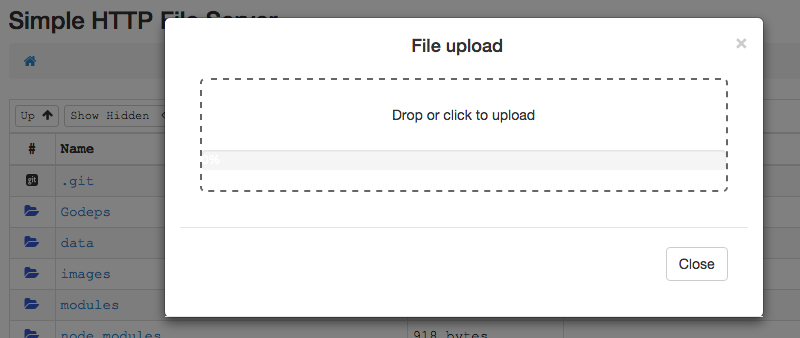

# gohttp
A http file server written by golang and reactjs.

Binary can be download from [gorelease](http://gorelease.herokuapp.com/codeskyblue/gohttp)

## Usage
```
# basic usage
gohttp --port 8000 --root /your/workdir

Usage: gohttp [<flags>]

Flags:
  -h, --help                     Show context-sensitive help (also try
                                 --help-long and --help-man).
      --port=8000                Port to listen
      --root="."                 File root directory
      --private                  Only listen on loopback address
      --httpauth=HTTPAUTH        HTTP basic auth (ex: user:pass)
      --cert=CERT                TLS cert.pem
      --key=KEY                  TLS key.pem
      --ftp                      Enable FTP support
      --ftp-port=2121            FTP listen port
      --ftp-auth="admin:123456"  FTP auth (ex: user:pass)
```




## Features
1. Support QRCode code generate
1. All assets package to Standalone binary
1. Different file type different icon
1. Support show or hide hidden files
1. Upload support
1. README.md preview
1. HTTP Basic Auth
1. Gzip support
1. When only one dir under dir, path will combine two together
1. Directory zip download
1. Code preview
1. Apple ipa auto generate .plist file, qrcode can be recognized by iphone (Require https)
1. Add ftp support(beta)

**Troubles**

* ipv6 not supported by goftp


About **https**

There is a [Chinese doc about how to set up nginx and generate self signed keys](docs/CA_NGINX.md)

## Build
Suggest install node through [nvm](https://github.com/creationix/nvm)

	go get -u github.com/jteeuwen/go-bindata/...
	npm install -g webpack
	npm install
	make prod

### Develop
Your need to know what is react, and golang.
In develop mode, Support react hot reload

	npm install
	make dev

Open another terminal

	go build && ./gohttp

### API
Upload

`POST /upload-dir`

*upload-dir* is just a name which you can change it easily.

Field name | Description | Example
-----------|-------------|--------
file       | Upload file | file=@upload.txt
path       | Upload path(optional) | path=/tmp/
name       | Save name (optional, need version set)  | name=foo
version    | Upload version | version=1.2.0

Use CURL

	# Normal upload
	curl -F file=@upload.txt ${SERVER}

	# Versioned upload
	curl -F file=@foo-windows.txt -F file=@foo-mac.txt -F name=foo -F version=1.0.1 ${SERVER}

	# will create dir structure
	foo/
	  |- foo-latest(symlink) -> foo-1.0.1
	  `- foo-1.0.1/
	      |- foo-windows.txt
	      `- foo-mac.txt

## Thanks
1. <https://github.com/shenfeng/http-watcher>
2. <http://segmentfault.com/a/1190000002551952>
3. [update package.json dependencies](http://stackoverflow.com/questions/16073603/how-do-i-update-each-dependency-in-package-json-to-the-latest-version)
4. [react hot reload QA](https://github.com/gaearon/react-hot-loader/blob/master/docs/Troubleshooting.md)
5. <https://github.com/evilstreak/markdown-js>
